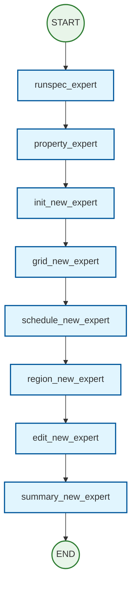

```mermaid
graph TD
    %% 节点样式定义
    classDef expert fill:#e1f5fe,stroke:#01579b,stroke-width:2px;
    classDef startend fill:#e8f5e9,stroke:#2e7d32,stroke-width:2px,rx:10,ry:10;

    %% 节点定义
    START((START)):::startend
    runspec[runspec_expert]:::expert
    prop[property_expert]:::expert
    init[init_new_expert]:::expert
    grid[grid_new_expert]:::expert
    sched[schedule_new_expert]:::expert
    region[region_new_expert]:::expert
    edit[edit_new_expert]:::expert
    summary[summary_new_expert]:::expert
    END((END)):::startend

    %% 边连接
    START --> runspec
    runspec --> prop
    prop --> init
    init --> grid
    grid --> sched
    sched --> region
    region --> edit
    edit --> summary
    summary --> END
```